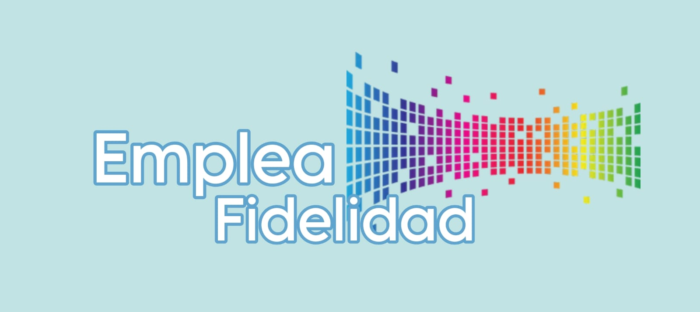

# 

# <h1 align="center">_EmpleaFidelidad_</h1>

<!-- 

  

 -->

  

## _Índice de Contenidos_

- [Contexto y Problemática](#contexto-y-problemática)
- [Impacto de la Problemática](#impacto-de-la-problemática)
- [Objetivo del Proyecto](#objetivo-del-proyecto)
- [Conclusión](#conclusión)
- [Fuentes de datos](#fuentes-de-datos)
- [Diagrama de Gantt](#diagrama-de-gantt)
- [Dashboard](#dashboard)
- [Colaboradores](#colaboradores)
- [Tecnologías](#tecnologías)
- [Enlaces del Proyecto](#enlaces-del-proyecto)

## _Contexto y Problemática_
 Hoy en día, la retención de empleados se ha convertido en una de las principales preocupaciones para las empresas. La alta rotación de personal no solo representa costos significativos en términos de reclutamiento y capacitación, sino que también afecta negativamente la moral del equipo y la productividad general. Las organizaciones que no logran retener a sus empleados ierden talento valioso y enfrentan desafíos adicionales para mantener la continuidad en sus operaciones.

##  _Impacto de la Problemática_

 La incapacidad de retener a los empleados puede llevar a una serie de problemas, incluyendo:

 **Aumento de Costos**: Gastos en reclutamiento, formación de nuevos empleados y pérdida de productividad durante el período de adaptación.

 **Pérdida de Conocimiento**: Los empleados que se marchan llevan consigo el conocimiento adquirido sobre los procesos y la cultura de la empresa.
 
 **Desmoralización del Equipo**: La salida frecuente de colegas puede afectar la moral y la motivación del equipo restante.

## _Objetivo del Proyecto_
 El objetivo principal de este proyecto es analizar los datos de recursos humanos para identificar los factores que influyen en la retención de empleados y desarrollar estrategias efectivas para mejorar la retención.

 ## _Conclusión_
 El análisis de retención de empleados proporciona una oportunidad invaluable para que las empresas comprendan mejor las razones detrás de la rotación de personal y tomen
 medidas proactivas para mejorar la satisfacción y retención de sus empleados. Con un enfoque basado en datos y el uso de modelos de machine learning, se pueden
 desarrollar estrategias efectivas que no solo mejoren la retención, sino que también contribuyan al crecimiento y éxito a largo plazo de la empresa.

(<a href="#readme-top">ir arriba</a>)

## _Diagrama de Gantt_

<table align="center">
  <tr>
    <td align="center">
  </tr>
</table>

<table align="center">
  <tr>
    <td align="center">
  </tr>
</table>

(<a href="#readme-top">ir arriba</a>)

## _Dashboard_

    

        

        

    

    

        

        

    

(<a href="#readme-top">ir arriba</a>)

## _Colaboradores_

<table align="center">
  <tr>
    <td align="center"><b>Matias Ponce</b></td>
    <td align="center"><b>Francisco Vela</b></td>
    <td align="center"><b>Marcelo Ortiz</b></td>
  </tr>
  <tr>
    <td align="center"></td>
    <td align="center"></td>
    <td align="center"></td>
  </tr>
  <tr>
    <td align="center">PM / Data Engineer</td>
    <td align="center">Data Analyst</td>
    <td align="center">Data Analyst</td>
  </tr>
  <tr>
    <td align="center"></td>
    <td align="center"></td>
    <td align="center"></td>
  </tr>
  <tr>
    <td align="center"></td>
    <td align="center"></td>
    <td align="center"></td>
  </tr>
</table>

<table align="center">
  <tr>
    <td align="center"><b>Gerardo Toso</b></td>
    <td align="center"><b>David Ramirez</b></td>
    <td align="center"><b>Daniel Ceballos</b></td>
    <td align="center"><b>Veronica Molinari</b></td>
  </tr>
  <tr>
    <td align="center"></td>
    <td align="center"></td>
    <td align="center"></td>
    <td align="center"></td>
  </tr>
  <tr>
    <td align="center">Data Scientist</td>
    <td align="center">ML Engineer</td>
    <td align="center">ML Engineer</td>
    <td align="center">Team Leader</td>
  </tr>
  <tr>
    <td align="center"></td>
    <td align="center"></td>
    <td align="center"></td>
    <td align="center"></td>
  </tr>
  <tr>
    <td align="center"></td>
      <td align="center"></td>
    <td align="center"></td>
    <td align="center"></td>
  </tr>
</table>

(<a href="#readme-top">ir arriba</a>)

## _Tecnologías_

## _Enlaces del Proyecto_

(<a href="#readme-top">ir arriba</a>)

